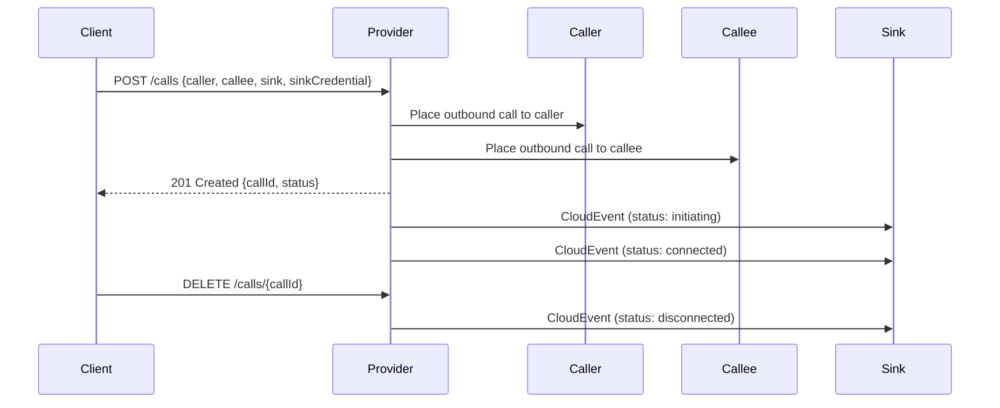

# Overview

The Click to Dial API allows users to initiate and manage calls via an enterprise platform or application. The API processes call requests, sets up the call, and provides optional notifications and call recording features.

## 1\. Introduction


## 2\. Quick Start

### 2.1 Prerequisites

- **Authentication**: Obtain an OpenID Connect access token from your API provider.

  ```bash
  curl -X POST "{openid_token_url}" -d "grant_type=client_credentials&client_id={your_id}&client_secret={your_secret}"
  ```

### 2.2 Quick Try

#### 2.2.1 Initiate a Call

```bash
curl -X POST "{apiRoot}/calls" \
     -H "Authorization: Bearer {access_token}" \
     -H "Content-Type: application/json" \
     -d '{
      "caller": { "number": "+12345678" }, 
      "callee": { "number": "+87654321" },
      "sink": "https://yourapp.example.com/clicktodialstatusnotify",
      "sinkCredential": {
        "credentialType": "ACCESSTOKEN",
        "accessToken": "{sink_access_token}",
        "accessTokenExpiresUtc": "2025-12-31T23:59:59Z",
        "accessTokenType": "bearer"
      },
      "recordingEnabled": true
    }'
```

- **Response:**

```json
{
  "callId": "123e4567-e89b-12d3-a456-426614174000",
  "caller": { "number": "+12345678" },
  "callee": { "number": "+87654321" },
  "status": "initiating",
  "createdAt": "2025-12-11T12:00:00Z",
  "recordingEnabled": true
}
```

#### 2.2.2 Status Notification Callback

- Implement an HTTP POST endpoint at your provided `sink` URL to receive status notifications. Example payloads are provided in the OpenAPI spec.

#### 2.2.3 Release a Call

```bash
  curl -X DELETE "{apiRoot}/calls/{callId}" \
       -H "Authorization: Bearer {access_token}" \
```

**Response:**
HTTP 204 No Content

#### 2.2.4 Download Recording

```bash
curl -X GET "{apiRoot}/calls/{callId}/recording" \
     -H "Authorization: Bearer {access_token}" \
```

**Response:**

```json
{
  "callId": "123e4567-e89b-12d3-a456-426614174000",
  "content": "BASE64_ENCODED_AUDIO",
  "contentType": "audio/wav",
  "generatedAt": "2025-12-11T12:05:00Z"
}
```

### 2.3 Key Tips

- **Number Format:** All phone numbers (caller, callee) must be in E.164 format, e.g., "+12345678".
- **Authentication:** Use OpenID Connect; include your access token as a Bearer token.
- **Status Codes:** 201 = created (POST /calls), 200 = success for reads, 204 = no content (DELETE /calls/{callId}), 400 = bad input, 401 = unauthorized, 403 = forbidden, 404 = not found, 409 = conflict, 422 = validation error.
- **Debugging:** Error responses include a code and description/message.

## 3\. Authentication and Authorization

This API uses **OpenID Connect** for authentication and authorization. Obtain your access token from your provider and use it in the Authorization header for all API requests.

## 4\. API Documentation

### 4.1 API Version

wip

### 4.2 Details

#### 4.2.1 API sequencing

1. Client calls **POST /calls** to start a call.
2. Server initiates calls to both caller and callee.
3. (Optional) Client may call **DELETE /calls/{callId}** to end a call.
4. Status notifications are sent via HTTP POST to the provided `sink` URL as CloudEvents (structured mode).

#### 4.2.1 API attributes

##### Click to Dial Initiation Request

| Name           | Description                                         | Required | Example                      |
| -------------- | --------------------------------------------------- | -------- | ---------------------------- |
| caller         | Calling party number (E.164, with "+")              | Yes      | "+12345678"                  |
| callee         | Called party number (E.164, with "+")               | Yes      | "+87654321"                  |
| sink           | (Optional) Callback URL for status notifications    | No       | `<https://yourapp.com/notify>` |
| sinkCredential | (Optional) Callback authentication info (see below) | No       | (see below)                  |

##### sinkCredential (for `ACCESSTOKEN` type)

The `SinkCredential` is a discriminator-based object. Currently the only supported `credentialType` is `ACCESSTOKEN` and the concrete `AccessTokenCredential` MUST include the fields below.

| Name                  | Description                                   | Required | Example                |
| --------------------- | --------------------------------------------- | -------- | ---------------------- |
| credentialType        | Must be `ACCESSTOKEN` (discriminator)         | Yes      | `ACCESSTOKEN`          |
| accessToken           | Access token used to authenticate event POSTs | Yes      | `sink_token`           |
| accessTokenExpiresUtc | UTC expiry timestamp for the access token     | Yes      | `2025-12-31T23:59:59Z` |
| accessTokenType       | Token type (OAuth token type)                 | Yes      | `bearer`               |

##### Click to Dial Status Notify (callback payload)

Status notifications are delivered as CloudEvents (see CloudEvent section below). The `data` payload for `EventCTDStatusChanged` contains the following fields. Note that `status` is now an object containing `state` and optional `reason`.

| Name            | Description                                              | Required | Notes/Values                                                                 |
| --------------- | -------------------------------------------------------- | -------- | ----------------------------------------------------------------------------- |
| caller          | Calling party number (E.164)                             | Yes      |                                                                               |
| callee          | Called party number (E.164)                              | Yes      |                                                                               |
| status          | Object with `state` (lifecycle) and optional `reason`    | Yes      | `state`: `initiating`,`callingCaller`,`callingCallee`,`connected`,`disconnected`,`failed` |
| status.reason   | Disconnection reason (if `state` is `disconnected`)      | Cond.    | `hangUp`,`callerBusy`,`callerNoAnswer`,`callerFailure`,`callerAbandon`,`calleeBusy`,`calleeNoAnswer`,`calleeFailure`,`other` |
| recordingResult | Recording result when recording enabled                  | Cond.    | `success`,`noRecord`,`fail`                                                   |
| callDuration    | Duration in seconds (present when call ended)            | Cond.    |                                                                               |
| timestamp       | UTC timestamp of the event / state change                | Yes      | RFC 3339 format                                                               |
| callId          | Identifier of the call (matches the `callId` returned)   | Yes      | UUID style string                                                             |

#### Release Call

- Call identifier is provided as a path parameter in DELETE `/calls/{callId}`.

#### Recording Download

- Call identifier as path parameter in GET `/calls/{callId}/recording`.

### 4.3 Endpoint Definitions

| Endpoint                             | Method | Description                        |
| ------------------------------------ | ------ | ---------------------------------- |
| /calls                               | POST   | Start a click-to-dial call         |
| /calls/{callId}                      | GET    | Retrieve call details              |
| /calls/{callId}                      | DELETE | End (release) a click-to-dial call |
| /calls/{callId}/recording            | GET    | Download call recording            |

### 4.4 Errors

Errors follow the standard format:

```json
{
  "status": 400,
  "code": "INVALID_ARGUMENT",
  "message": "Client specified an invalid argument, request body or query param."
}
```

Reference the [OpenAPI YAML](../../code/API_definitions/click-to-dial.yaml) for exact error codes and descriptions.

#### 4.4.1 422 — Business error codes (Unprocessable Entity)

When a request is syntactically correct but semantically invalid, the API returns `422 Unprocessable Entity` with a business `code` describing the error. The following 422 business error codes are defined in the OpenAPI spec:

| Code | Description |
| ---- | ----------- |
| `INVALID_PHONE_NUMBER` | Caller or callee number is not a valid E.164 phone number. |
| `SAME_CALLER_CALLEE` | Caller and callee cannot be the same number. |
| `RECORDING_NOT_SUPPORTED` | Recording is not supported for this call. |
| `CALLER_NOT_AVAILABLE` | Caller number is currently not reachable or not allowed to start a call. |
| `CALLEE_NOT_AVAILABLE` | Callee number is currently not reachable or not allowed to receive a call. |
| `INSUFFICIENT_BALANCE` | The account does not have sufficient balance or quota to start this call. |
| `RESTRICTED_DESTINATION` | The destination number is restricted and cannot be called. |

Example 422 response:

```json
{
  "status": 422,
  "code": "INVALID_PHONE_NUMBER",
  "message": "Caller or callee number is not a valid E.164 phone number."
}
```

Note: Additional common CAMARA error responses may be defined in the `CAMARA_common.yaml` referenced by this API's readiness checklist. Always consult the OpenAPI YAML for the authoritative list.

## CloudEvent delivery notes

- Providers MUST send status notifications as CloudEvents in structured mode. The HTTP header must be `Content-Type: application/cloudevents+json`.
- The CloudEvent MUST include the attributes: `id`, `source`, `type`, `specversion`, `time`, and `subject` (subject should identify the resource, e.g. `/calls/{callId}`).
- The CloudEvent attribute `datacontenttype` MUST be `application/json` for the `data` payload.

The CloudEvent `data` payload for Click-to-Dial `EventCTDStatusChanged` includes `callId`, `caller`, `callee`, `timestamp` and `status` (where `status` is an object with `state` and optional `reason`). Providers MUST set the CloudEvent `subject` to the affected resource (for example `/calls/{callId}`) and set `datacontenttype` to `application/json`.

Example CloudEvent (structured mode) — `CALL_STATUS_CHANGED_EXAMPLE` from the OpenAPI spec:

```json
{
  "id": "83a0d986-0866-4f38-b8c0-fc65bfcda452",
  "source": "https://api.example.com/click-to-dial",
  "subject": "/calls/123e4567-e89b-12d3-a456-426614174000",
  "specversion": "1.0",
  "datacontenttype": "application/json",
  "type": "org.camaraproject.click-to-dial.v0.status-changed",
  "time": "2021-12-12T00:00:00Z",
  "data": {
    "callId": "123e4567-e89b-12d3-a456-426614174000",
    "caller": "+12345678",
    "callee": "+12345678",
    "status": {
      "state": "disconnected",
      "reason": "hangUp"
    },
    "recordingResult": "success",
    "callDuration": "1600",
    "timestamp": "2017-12-04T18:07:57Z"
  }
}
```

Providers SHOULD ensure event `id` uniqueness and may retry delivery on transient failures. When delivering events to a `sink` that requires authentication, use the provided `sinkCredential` (e.g., set `Authorization: Bearer <accessToken>` for `ACCESSTOKEN`).

## Call flow (sequence diagram)

The following sequence diagram shows the typical flow when creating a Click-to-Dial session, delivering events, and terminating the call. This is a logical flow; implementers may optimize or parallelise steps.




### 4.5 Policies

N/A

### 4.6 Example Code Snippets

#### Start a Call

```bash
curl -X POST "{apiRoot}/calls" \
  -H "Authorization: Bearer {access_token}" \
  -H "Content-Type: application/json" \
  -d '{
    "caller": { "number": "+12345678" },
    "callee": { "number": "+87654321" },
    "sink": "https://yourapp.example.com/clicktodialstatusnotify",
    "sinkCredential": {
      "credentialType": "ACCESSTOKEN",
      "accessToken": "{sink_access_token}",
      "accessTokenExpiresUtc": "2025-12-31T23:59:59Z",
      "accessTokenType": "bearer"
    }
  }'
```

#### Release a Call

```bash
curl -X DELETE "{apiRoot}/calls/{callId}" \
  -H "Authorization: Bearer {access_token}"
```

#### Download a Recording

```bash
curl -X GET "{apiRoot}/calls/{callId}/recording" \
  -H "Authorization: Bearer {access_token}"
```

### 4.7 FAQ's

To be added in future versions.

### 4.8 Terms

N/A

### 4.9 Release Notes

This section lists release notes for historical versions.
The current version on the main branch is **wip**.

- **0.1.0-alpha.1** — Initial release (archived).

## References

For a full API schema, see [code/API_definitions/click-to-dial.yaml](../../code/API_definitions/click-to-dial.yaml).
