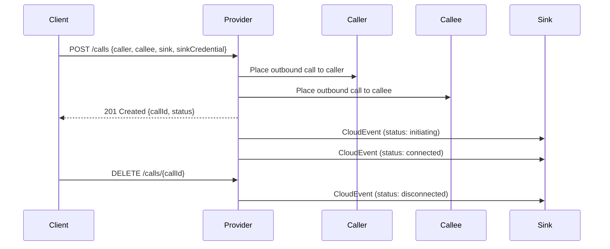

# Overview

The Click to Dial API allows API consumers to initiate and manage voice calls between two parties. The API processes call requests, sets up the call, and provides optional status notifications and call recording features.

## 1. Introduction

The Click to Dial API provides a standardized interface to initiate and manage voice call sessions between two parties. It allows API consumers to create a call session, retrieve call status and details, terminate an active call, and retrieve call recordings (if enabled).


## 2\. Quick Start

### 2.1 Prerequisites

- **Authentication**: Obtain an OpenID Connect access token from the API provider's Authorization Server.
  - The API Consumer must use `private_key_jwt` client authentication, in accordance with the [CAMARA Security & Interoperability Profile](https://github.com/camaraproject/IdentityAndConsentManagement/blob/r4.2/documentation/CAMARA-Security-Interoperability.md#client-authentication).
  - The specific authorization flows, grant types, and other parameters are determined during onboarding between the API Consumer and the API Provider.
  - API requests carry the access token in the `Authorization` header as `Bearer <access_token>`.
  - The OpenAPI definition specifies the `openId` security scheme and the required scopes for each operation.

### 2.2 Quick Try

#### 2.2.1 Initiate a Call

```bash
curl -X POST "{apiRoot}/calls" \
     -H "Authorization: Bearer {access_token}" \
     -H "Content-Type: application/json" \
     -d '{
      "caller": { "number": "+12345678" }, 
      "callee": { "number": "+87654321" },
      "sink": "https://yourapp.example.com/clicktodialstatusnotify",
      "sinkCredential": {
        "credentialType": "ACCESSTOKEN",
        "accessToken": "{sink_access_token}",
        "accessTokenExpiresUtc": "2025-12-31T23:59:59Z",
        "accessTokenType": "bearer"
      },
      "recordingEnabled": true
    }'
```

- **Response:**

```json
{
  "callId": "123e4567-e89b-12d3-a456-426614174000",
  "caller": { "number": "+12345678" },
  "callee": { "number": "+87654321" },
  "status": "initiating",
  "createdAt": "2025-12-11T12:00:00Z",
  "recordingEnabled": true
}
```

#### 2.2.2 Status Notification Callback

- Implement an HTTP POST endpoint at your provided `sink` URL to receive status notifications. Example payloads are provided in the OpenAPI spec.

#### 2.2.3 Release a Call

```bash
  curl -X DELETE "{apiRoot}/calls/{callId}" \
       -H "Authorization: Bearer {access_token}" \
```

**Response:**
HTTP 204 No Content

#### 2.2.4 Download Recording

```bash
curl -X GET "{apiRoot}/calls/{callId}/recording" \
     -H "Authorization: Bearer {access_token}" \
```

**Response:**

```json
{
  "callId": "123e4567-e89b-12d3-a456-426614174000",
  "content": "BASE64_ENCODED_AUDIO",
  "contentType": "audio/wav",
  "generatedAt": "2025-12-11T12:05:00Z"
}
```

### 2.3 Key Tips

- **Number Format:** All phone numbers (caller, callee) must be in E.164 format, e.g., "+12345678".
- **Authentication:** Use OpenID Connect; include your access token as a Bearer token.
- **Status Codes:** 201 = created (POST /calls), 200 = success for reads, 204 = no content (DELETE /calls/{callId}), 400 = bad input, 401 = unauthorized, 403 = forbidden, 404 = not found, 409 = conflict, 422 = validation error.
- **Debugging:** Error responses include a code and description/message.

## 3\. Authentication and Authorization

This API uses **OpenID Connect** for authentication and authorization.
- The API Consumer obtains an access token from the API Provider's Authorization Server.
- The API Consumer must use `private_key_jwt` client authentication, in accordance with the [CAMARA Security & Interoperability Profile](https://github.com/camaraproject/IdentityAndConsentManagement/blob/r4.2/documentation/CAMARA-Security-Interoperability.md#client-authentication).
- The specific authorization flows, grant types, and other parameters to be used will be agreed during the onboarding process between the API Consumer and the API Provider.
- API requests carry the access token in the `Authorization` header as `Bearer <access_token>`.
- The OpenAPI definition specifies the `openId` security scheme and the required scopes for each operation.

## 4\. API Documentation

### 4.1 API Version

The OpenAPI definition version in the `main` branch may remain as `wip` until a release snapshot is created. Released versions and their corresponding API versions are determined by GitHub Releases, the CHANGELOG, and the OpenAPI definition under the specific release tag.

- [OpenAPI definition](../../code/API_definitions/click-to-dial.yaml)
- [CHANGELOG](../../CHANGELOG/)
- [GitHub Releases](https://github.com/camaraproject/ClickToDial/releases)

### 4.2 Details

#### 4.2.1 API sequencing

1. Client calls **POST /calls** to start a call.
2. Server initiates calls to both caller and callee.
3. (Optional) Client may call **DELETE /calls/{callId}** to end a call.
4. Status notifications are sent via HTTP POST to the provided `sink` URL as CloudEvents (structured mode).

#### 4.2.2 Call Lifecycle

The Click to Dial API manages the call setup and connection using a unified call session. The API exposes an **aggregate provider-managed call session state**, rather than separate, independent caller and callee leg APIs.

The call session progresses through the following states (representing the `state` field of the call's status):

* **`initiating`**: The call session has been created. The provider is preparing to start the call process (e.g., reserving resources, performing initial validation).
* **`callingCaller`**: The provider is placing the outbound call to the caller, waiting for them to answer.
* **`callingCallee`**: The caller has answered, and the provider is placing the outbound call to the callee.
* **`connected`**: Both caller and callee have answered, and they are now connected in an active call session.
* **`disconnected`**: The call session has ended (either because one of the parties hung up, or because the API consumer explicitly released the call via `DELETE /calls/{callId}`). A disconnection reason is provided in `status.reason` (e.g., `hangUp`, `callerBusy`, `calleeBusy`, etc.).
* **`failed`**: The call session failed to establish (e.g., caller or callee did not answer within the timeout, or a network/carrier failure occurred).

#### 4.2.3 API attributes

##### Click to Dial Initiation Request

| Name             | Description                                         | Required | Example                        |
| ---------------- | --------------------------------------------------- | -------- | ------------------------------ |
| caller           | Calling party number (E.164, with "+")              | Yes      | "+12345678"                    |
| callee           | Called party number (E.164, with "+")               | Yes      | "+87654321"                    |
| sink             | (Optional) Callback URL for status notifications    | No       | `<https://yourapp.com/notify>` |
| sinkCredential   | (Optional) Callback authentication info (see below) | No       | (see below)                    |
| recordingEnabled | Whether call recording is enabled.                  | No       | true                           |

##### sinkCredential (for `ACCESSTOKEN` type)

The SinkCredential is a discriminator-based object defined by CAMARA Commonalities. The currently defined credential types include ACCESSTOKEN and PRIVATE_KEY_JWT. The example below uses ACCESSTOKEN. When ACCESSTOKEN is used, the provider sets Authorization: Bearer <accessToken> when delivering event notifications.

| Name                  | Description                                   | Required | Example                |
| --------------------- | --------------------------------------------- | -------- | ---------------------- |
| credentialType        | Must be `ACCESSTOKEN` (discriminator)         | Yes      | `ACCESSTOKEN`          |
| accessToken           | Access token used to authenticate event POSTs | Yes      | `sink_token`           |
| accessTokenExpiresUtc | UTC expiry timestamp for the access token     | Yes      | `2025-12-31T23:59:59Z` |
| accessTokenType       | Token type (OAuth token type)                 | Yes      | `bearer`               |

##### Click to Dial Status Notify (callback payload)

Status notifications are delivered as CloudEvents (see CloudEvent section below). The `data` payload for `CallStatusChangedEvent` contains the following fields. Note that `status` is now an object containing `state` and optional `reason`.

| Name            | Description                                              | Required | Notes/Values                                                                 |
| --------------- | -------------------------------------------------------- | -------- | ----------------------------------------------------------------------------- |
| caller          | Calling party number (E.164)                             | Yes      |                                                                               |
| callee          | Called party number (E.164)                              | Yes      |                                                                               |
| status          | Object with `state` (lifecycle) and optional `reason`    | Yes      | `state`: `initiating`,`callingCaller`,`callingCallee`,`connected`,`disconnected`,`failed` |
| status.reason   | Disconnection reason (if `state` is `disconnected`)      | Cond.    | `hangUp`,`callerBusy`,`callerNoAnswer`,`callerFailure`,`callerAbandon`,`calleeBusy`,`calleeNoAnswer`,`calleeFailure`,`other` |
| recordingResult | Recording result when recording enabled                  | Cond.    | `success`,`noRecord`,`fail`                                                   |
| callDuration    | Duration in seconds (present when call ended)            | Cond.    |                                                                               |
| timestamp       | UTC timestamp of the event / state change                | Yes      | RFC 3339 format                                                               |
| callId          | Identifier of the call (matches the `callId` returned)   | Yes      | String identifier compliant with the CallId schema                            |

#### Release Call

- Call identifier is provided as a path parameter in DELETE `/calls/{callId}`.

#### Recording Download

* Call identifier is provided as a path parameter in `GET /calls/{callId}/recording`.

##### Call Recording Availability

A call recording can be retrieved successfully only if all of the following conditions are met:
* Recording was explicitly requested/enabled in the creation request (`recordingEnabled: true`).
* Recording is supported by the provider for the specific call.
* The call has reached a final state (`disconnected` or `failed`).
* A recording was actually generated by the provider.

If no recording is available (for example, if recording was not requested, is not supported, the call is still active, or no recording could be generated), the API returns the documented error response, currently `404 Not Found` with the code `NOT_FOUND` (or `422 RECORDING_NOT_SUPPORTED` during call creation if the provider immediately knows recording cannot be enabled).

The `recordingResult` in the final callback event helps indicate whether a recording was generated (`success`, `noRecord`, or `fail`).

### 4.3 Endpoint Definitions

| Endpoint                             | Method | Description                        |
| ------------------------------------ | ------ | ---------------------------------- |
| /calls                               | POST   | Start a click-to-dial call         |
| /calls/{callId}                      | GET    | Retrieve call details              |
| /calls/{callId}                      | DELETE | End (release) a click-to-dial call |
| /calls/{callId}/recording            | GET    | Download call recording            |

### 4.4 Errors

Errors follow the standard format:

```json
{
  "status": 400,
  "code": "INVALID_ARGUMENT",
  "message": "Client specified an invalid argument, request body or query param."
}
```

Reference the [OpenAPI YAML](../../code/API_definitions/click-to-dial.yaml) for exact error codes and descriptions.

#### 4.4.1 422 — Business error codes (Unprocessable Entity)

When a request is syntactically correct but semantically invalid, the API returns `422 Unprocessable Entity` with a business `code` describing the error. The following 422 business error codes are defined in the OpenAPI spec:

| Code | Description |
| ---- | ----------- |
| `INVALID_PHONE_NUMBER` | Caller or callee number is not a valid E.164 phone number. |
| `SAME_CALLER_CALLEE` | Caller and callee cannot be the same number. |
| `RECORDING_NOT_SUPPORTED` | Recording is not supported for this call. |
| `CALLER_NOT_AVAILABLE` | Caller number is currently not reachable or not allowed to start a call. |
| `CALLEE_NOT_AVAILABLE` | Callee number is currently not reachable or not allowed to receive a call. |

Example 422 response:

```json
{
  "status": 422,
  "code": "INVALID_PHONE_NUMBER",
  "message": "Caller or callee number is not a valid E.164 phone number."
}
```

Note: Additional common CAMARA error responses may be defined in the `CAMARA_common.yaml` referenced by this API's readiness checklist. Always consult the OpenAPI YAML for the authoritative list.

## CloudEvent delivery notes

- Providers MUST send status notifications as CloudEvents in structured mode. The HTTP header must be `Content-Type: application/cloudevents+json`.
- The CloudEvent MUST include the attributes: `id`, `source`, `type`, `specversion`, and `time`.
- The `datacontenttype` attribute is optional in the CloudEvent schema. When present, it describes the media type of the data payload. For a JSON data payload, its value is `application/json`.

The CloudEvent `data` payload for Click-to-Dial `CallStatusChangedEvent` includes `callId`, `caller`, `callee`, `timestamp` and `status` (where `status` is an object with `state` and optional `reason`).

Example CloudEvent (structured mode) — `CALL_STATUS_CHANGED_EXAMPLE` from the OpenAPI spec:

```json
{
  "id": "83a0d986-0866-4f38-b8c0-fc65bfcda452",
  "source": "https://api.example.com/click-to-dial",

  "specversion": "1.0",
  "datacontenttype": "application/json",
  "type": "org.camaraproject.click-to-dial.v0.status-changed",
  "time": "2021-12-12T00:00:00Z",
  "data": {
    "callId": "123e4567-e89b-12d3-a456-426614174000",
    "caller": "+12345678",
    "callee": "+87654321",
    "status": {
      "state": "disconnected",
      "reason": "hangUp"
    },
    "recordingResult": "success",
    "callDuration": "1600",
    "timestamp": "2017-12-04T18:07:57Z"
  }
}
```

### Callback Authentication, Retries, and Resilience

* **Authentication**: When delivering events to a client's `sink` URL that requires authentication, the provider MUST use the provided `sinkCredential`. If the credential type is `ACCESSTOKEN`, the provider MUST set the HTTP `Authorization` header to `Authorization: Bearer <accessToken>` (using the value of the `accessToken` field from the request).
* **Delivery Retries**: Providers SHOULD ensure event `id` uniqueness. Transient callback delivery failures (e.g., connection timeouts, DNS resolution failures, or receiving `5xx` server error responses from the client's `sink` URL) may be retried by the provider according to its internal retry and backoff policy.
* **Session Resilience**: A callback delivery failure does **not** roll back or cancel a successfully created call session. The call session will continue to be processed and connected normally.
* **State Reconciliation**: API consumers can actively reconcile the call session state at any time by calling `GET /calls/{callId}` to retrieve the current status of the call. This is particularly useful if status notification events are delayed or fail to be delivered.

## Call flow (sequence diagram)

The following sequence diagram shows the typical flow when creating a Click-to-Dial session, delivering events, and terminating the call. This is a logical flow; implementers may optimize or parallelise steps.


```mermaid
sequenceDiagram
  participant Client
  participant Provider
  participant Caller
  participant Callee
  participant Sink

  Client->>Provider: POST /calls {caller, callee, sink, sinkCredential}
  Provider->>Caller: Place outbound call to caller
  Provider->>Callee: Place outbound call to callee
  Provider-->>Client: 201 Created {callId, status}
  Provider->>Sink: CloudEvent (status: initiating)
  Provider->>Sink: CloudEvent (status: connected)
  Client->>Provider: DELETE /calls/{callId}
  Provider->>Sink: CloudEvent (status: disconnected)
```


### 4.5 Policies

N/A

### 4.6 Example Code Snippets

#### Start a Call

```bash
curl -X POST "{apiRoot}/calls" \
  -H "Authorization: Bearer {access_token}" \
  -H "Content-Type: application/json" \
  -d '{
    "caller": { "number": "+12345678" },
    "callee": { "number": "+87654321" },
    "sink": "https://yourapp.example.com/clicktodialstatusnotify",
    "sinkCredential": {
      "credentialType": "ACCESSTOKEN",
      "accessToken": "{sink_access_token}",
      "accessTokenExpiresUtc": "2025-12-31T23:59:59Z",
      "accessTokenType": "bearer"
    }
  }'
```

#### Release a Call

```bash
curl -X DELETE "{apiRoot}/calls/{callId}" \
  -H "Authorization: Bearer {access_token}"
```

#### Download a Recording

```bash
curl -X GET "{apiRoot}/calls/{callId}/recording" \
  -H "Authorization: Bearer {access_token}"
```

### 4.7 FAQ's

To be added in future versions.

### 4.8 Terms

N/A

### 4.9 Release Notes

Please refer to the [CHANGELOG](../../CHANGELOG/) and [GitHub Releases](https://github.com/camaraproject/ClickToDial/releases) for the history of released versions and details of changes.

## References

For a full API schema, see [code/API_definitions/click-to-dial.yaml](../../code/API_definitions/click-to-dial.yaml).
